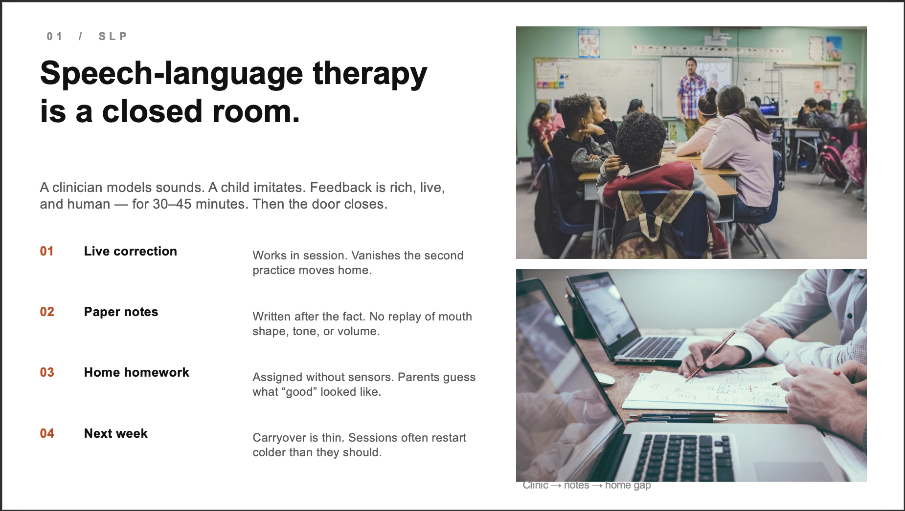
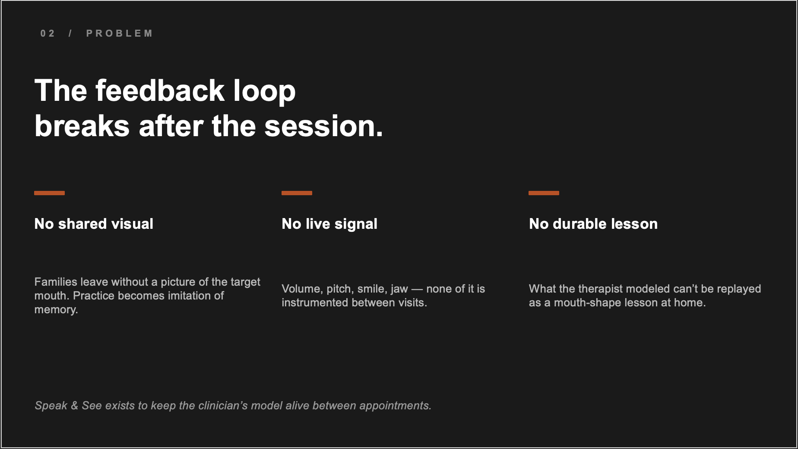
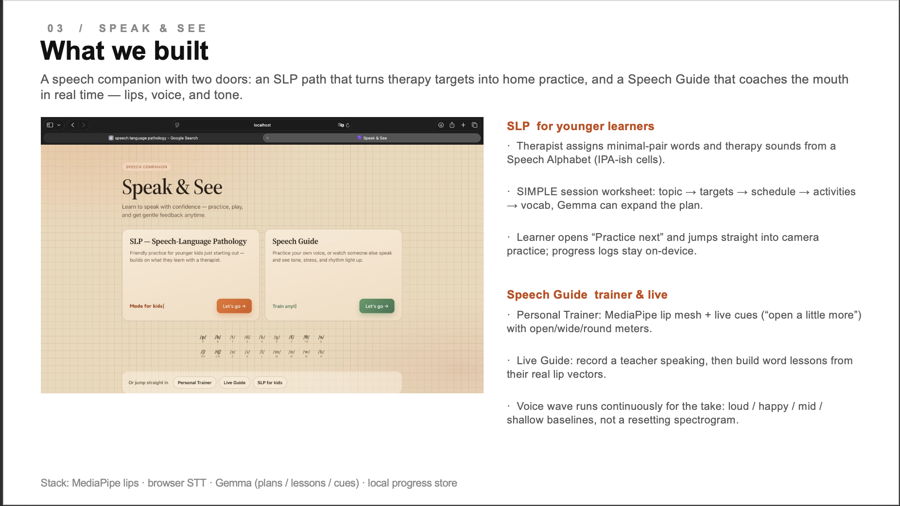
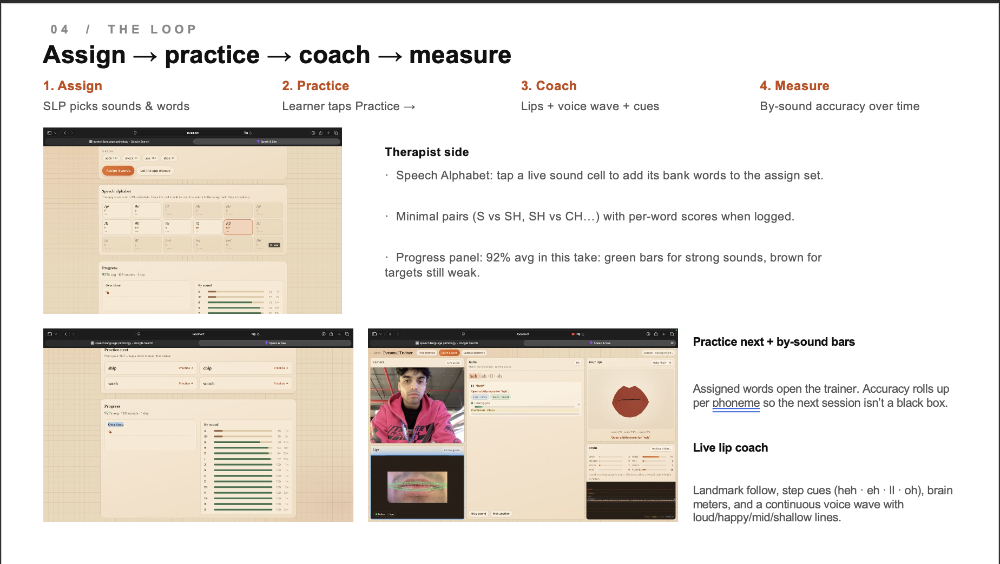

# Speak & See










Speech companion for Deaf/HoH users — Superhuman Lab hackathon.

## One command

```bash
npm run dev
```

Wakes **Ollama + `gemma3:4b`** (vision, ~3.3GB), FastAPI brain `:8000`, Vite `:5173`.

Open http://127.0.0.1:5173 → **Start**. Live meters update instantly; vision coaching refreshes every ~2–3s with the lip crop + all metrics.

## Deploy (heuristics-only)

Live: **https://claude-superhuman.vercel.app**

Static Vercel deploy of `web/` — no Ollama required. Brain API calls fall through to on-device heuristics.

```bash
npx vercel --prod
```

## Brain design (speed + accuracy)

| Layer | What | Latency |
|-------|------|---------|
| MediaPipe + audio | open / wide / round / vol / pitch / smile / jaw | frame-rate |
| Heuristic | instant tone / mood / lip tip | &lt;1ms |
| **Gemma 3 4B vision** | lip-crop JPEG + metrics → coaching JSON | ~1–3s |

UI never waits on the model — meters stay live; summary/cue soft-update when vision returns.

## Model

| Model | Disk | Role |
|-------|------|------|
| **`gemma3:4b`** (default) | ~3.3GB | Vision + metrics under 5GB |
| `moondream` | ~1.7GB | Smaller / faster vision fallback |
| `qwen2.5:0.5b` | ~0.4GB | Text-only (no vision) |

```bash
OLLAMA_MODEL=gemma3:4b npm run wake
```

## Architecture

Camera → MediaPipe lips + blendshapes  
Mic → volume / pitch / spectrogram  
STT → transcript  
Lip crop JPEG + all metrics → local Gemma vision  
→ tone, mood, intention, lip match, encouraging cue

## Live Guide

Record a teacher/friend speaking (camera + mic + MediaPipe lip vectors). After you stop, **Gemma builds word-by-word lessons** and attaches the teacher’s real mouth shapes. Those lessons show up in Personal Trainer → Learn a word.

## Personal Trainer

- **Free practice** — live meters + vision coaching.
- **Learn a word / Learn a sentence** — bank, custom (model), or **captured Live Guide** lessons with teacher MediaPipe vectors. Camera scores your lips live against each sound.
